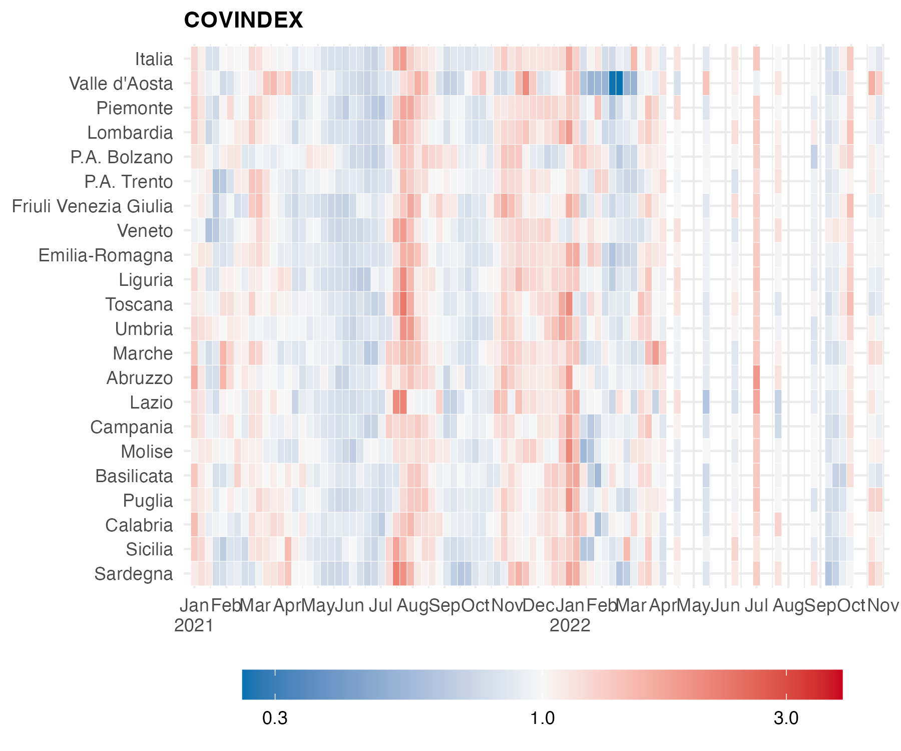

# COVINDEX

A near real-time COVID-19 index for monitoring the evolution of the pandemic based on a GAM beta regression model.

- This repository contains the R code to reproduce the analyses in the paper:

	Scrucca L. (2021) A COVINDEX based on a GAM beta regression model with an application to the COVID-19 pandemic in Italy. To appear in *Statistical Methods and Applications*  
	arXiv pre-print available at https://arxiv.org/abs/2104.01344

- Instructions:

	- open and execute the code contained in the file `covindex_analyses.R`.

 

A weekly report is available for Italy and Italian regions at http://www.stat.unipg.it/luca/COVINDEX.html

 

 

